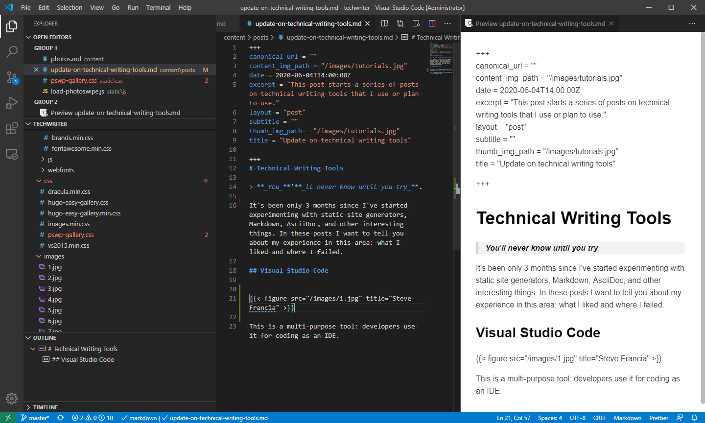

It's been only 3 months since I've started experimenting with static site generators, Markdown, AsciiDoc, and other interesting things. In these posts I want to tell you about my experience in this area: what I liked and where I failed.

<!--truncate-->

# Technical Writing Tools

> **_You_**'**_ll never know until you try_**.

It's been only 3 months since I've started experimenting with static site generators, Markdown, AsciiDoc, and other interesting things. In these posts I want to tell you about my experience in this area: what I liked and where I failed.

## Visual Studio Code

 

This is a multi-purpose tool: developers use it for coding as an IDE. However, I found out that some technical writers use VSCode for writing and editing their documents.

Here are some basics that I use in VSCode:

1. Download and install VSCode:  
   [https://code.visualstudio.com/download](https://code.visualstudio.com/download "https://code.visualstudio.com/download")
2. Open your project folder: `Ctrl+O`
3. Use VSCode for git commands: `Ctrl+Shift+P`  
   
4. Toggle word wrap: `Alt+Z`
5. Open **Extensions**: `Ctrl+Shift+X`  
   
6. Search for useful extensions such as **Markdown Preview Enhanced** and click **Install**.
7. Click the icon for Markdown Preview Enhanced to show preview of your current document in the side panel.  
   
8. Find text in the files of your open project: `Ctrl+Shift+F`  
   

**Note.** In case of a merge conflict, merge your changes and use:

    git add .
    git commit -m "fix merge issue"
    git push